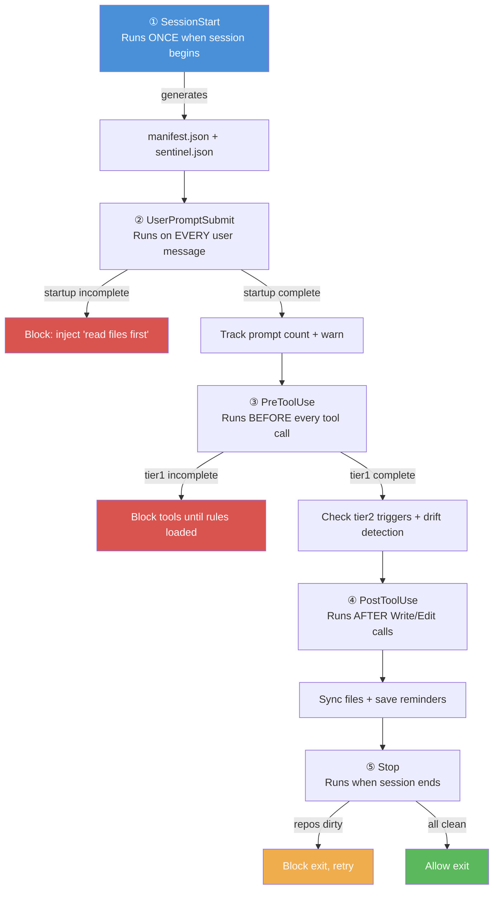
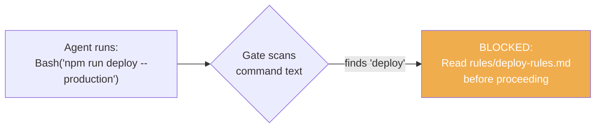
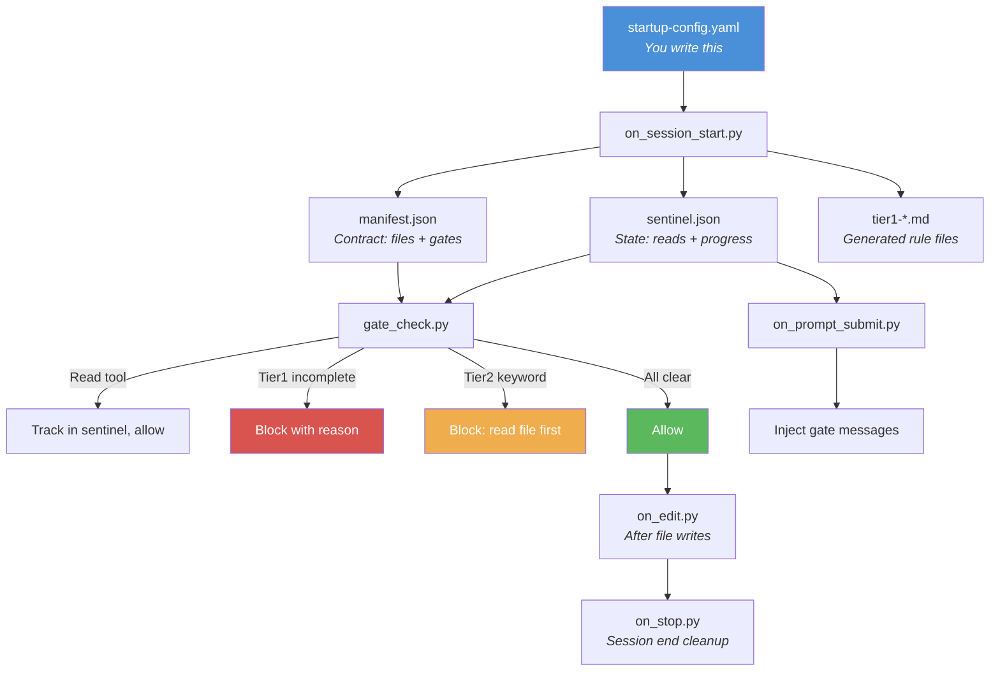

# Module 2: Architecture Concepts

**Time:** 15 minutes
**Goal:** Understand the 4-hook system, how the pieces interact, and the
key design decisions that make it work.

---

## The Four Hook Points

AI coding agents provides hooks — shell commands that run automatically at
specific moments in a session. This architecture uses four of them:



Each hook is a Python script that receives context on stdin and outputs
decisions on stdout.

## The Two Key Files

### Manifest (`manifest.json`)

Generated fresh each session by the SessionStart hook. Contains:
- List of tier1 files (paths, line counts, descriptions)
- List of tier2 files (triggers, sources)
- Gate configuration (what to enforce)
- Cross-check expectations (what counts to verify)

```json
{
  "session_id": "abc123",
  "tier1": [
    {"name": "core-rules", "path": "/tmp/tier1-core-rules-abc123.md", "lines": 45}
  ],
  "tier2": [
    {"name": "deploy-rules", "triggers": ["deploy", "release"], "source": "rules/deploy.md"}
  ],
  "gates": {"block_until_tier1": true}
}
```

The manifest is the **contract** between SessionStart (which generates files)
and the gates (which enforce loading).

### Sentinel (`startup-complete-{session}.json`)

Tracks progress through startup:

```json
{
  "session_id": "abc123",
  "stage": "tier1_pending",        ← becomes "complete" when all read
  "completed_reads": [],            ← file names added as the agent reads them
  "cross_check_done": false         ← flips to true after drift check runs
}
```

The sentinel is how the system knows where the agent is in the startup
process without relying on the agent's self-reporting.

## The Tier System

### Tier 1: Always Load

Rules and context needed in >80% of sessions. Loaded at the start of
every session, enforced by gates.

**Good tier1 content:**
- Project coding standards
- Key architectural decisions
- Current project state (what's active, what's blocked)
- Infrastructure facts (DB location, API endpoints)

**Bad tier1 content:**
- Deployment procedures (only needed when deploying)
- API documentation (only needed when working on APIs)
- Testing guidelines (only needed when writing tests)

**Target:** Under 1500 lines total. More than that wastes context on
sessions that don't need everything.

### Tier 2: Load On Demand

Rules that apply to specific tasks, loaded when the agent's tool calls
contain matching keywords.



**Trigger design tips:**
- Use 2+ word phrases to avoid false positives ("deploy production" not just "deploy")
- Only scan the first ~120 characters of tool input
- Only scan specific fields (command, file_path, prompt) — not the full JSON

## Six Design Decisions

These decisions emerged from real failures. Understanding them prevents
you from repeating them.

### 1. Gate, Don't Nag

CLAUDE.md instructions are suggestions. Hooks that return `permissionDecision: "deny"`
are gates. the agent can ignore a suggestion; it cannot bypass a denied tool call.

### 2. Track Reads, Not Intentions

The sentinel tracks which files the agent actually read (detected via file path
matching in the PreToolUse hook). It does not trust the agent saying "I've loaded
the rules." Verify, don't trust.

### 3. Session-Scope Everything

All temporary files include the session ID (`-{SESSION_ID}`). Without this,
concurrent sessions or resumed sessions overwrite each other's state, causing
mysterious failures.

### 4. Exit Codes Lie

Shell commands with pipes (`cmd | grep`), logical operators (`cmd || echo ok`),
and subshells mask real failures behind exit code 0. The validator registry
parses stdout instead of trusting `$?`.

### 5. Bound Your Loops

Drift detection runs a maximum of 2 passes: detect → fix safe items → re-check → stop.
Without a bound, auto-fix cycles can spiral when fixes create new drift.

### 6. Tier by Frequency, Not Importance

Critical API security rules that only matter during API work belong in tier2
with an "api" trigger. Putting them in tier1 wastes tokens in 80% of sessions
where no API work happens. Importance ≠ frequency of need.

---

## How the Pieces Connect


```

---

## Knowledge Check

Before moving to Module 3, make sure you can answer:

1. What's the difference between the manifest and the sentinel?
2. Why do we track file reads in the sentinel instead of trusting the agent?
3. When should a rule be tier1 vs tier2?
4. Why do we parse stdout instead of checking exit codes?

If any answer isn't clear, re-read the relevant section above.

---

**Next:** [Module 3 — Your First Startup Hook](module-3-first-hook.md)
