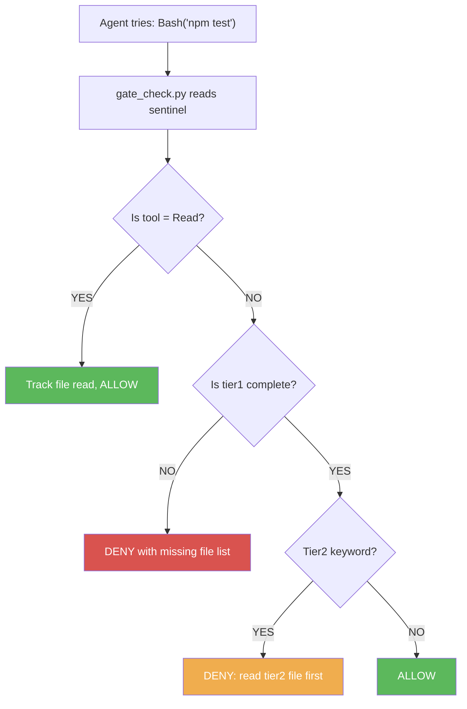
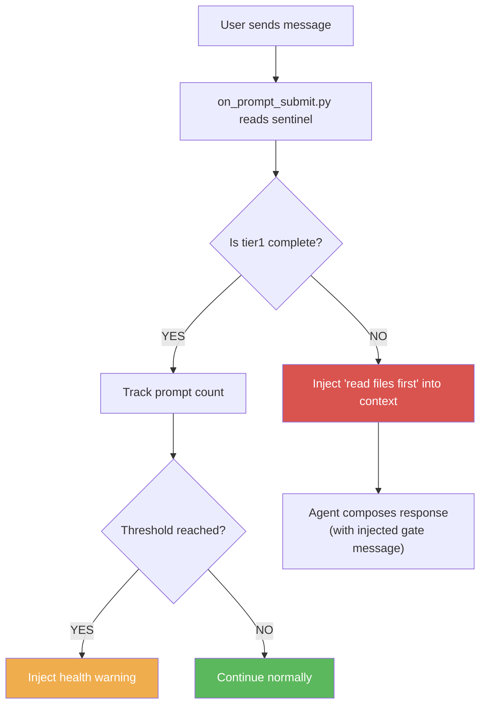

# Module 4: Adding Gates

**Time:** 20 minutes
**Goal:** Add structural enforcement — the agent cannot use any tool until
all tier1 files are read. Add prompt-level gate as a second layer.

---

## Why Gates Matter

In Module 3, the agent *should* read the tier1 files but *can* skip them.
There's no enforcement. This module adds two gates that make reading
the files mandatory:

| Gate | Hook | What It Does |
|------|------|-------------|
| Tool Gate | PreToolUse | Blocks Bash, Write, Edit, Agent — only allows Read |
| Prompt Gate | UserPromptSubmit | Injects "read files first" into the agent's context |

Together, these create a two-layer defense:
- **Tool Gate** prevents the agent from doing work without rules
- **Prompt Gate** prevents the agent from responding without rules

---

## Step 1: Install the Gate Scripts (3 minutes)

If you used `setup.py` with Level 2+, these are already installed. Otherwise:

```bash
cp path/to/agentic-ai-tiered-startup/hooks/gate_check.py .agent/hooks/
cp path/to/agentic-ai-tiered-startup/hooks/on_prompt_submit.py .agent/hooks/
```

## Step 2: Enable Gates in Config (2 minutes)

Update `startup-config.yaml`:

```yaml
gates:
  block_until_tier1: true          # ← Changed from false to true
  tier2_keyword_scan: false        # We'll enable this in Module 5
  prompt_health_warnings: [40, 60, 80]
```

## Step 3: Wire the Hooks (3 minutes)

Update `.agent/settings.json`:

```json
{
  "hooks": {
    "SessionStart": [
      {
        "matcher": "",
        "hooks": [{
          "type": "command",
          "command": "python3 .agent/hooks/on_session_start.py",
          "timeout": 60000
        }]
      }
    ],
    "PreToolUse": [
      {
        "matcher": "",
        "hooks": [{
          "type": "command",
          "command": "python3 .agent/hooks/gate_check.py",
          "timeout": 5000
        }]
      }
    ],
    "UserPromptSubmit": [
      {
        "matcher": "",
        "hooks": [{
          "type": "command",
          "command": "python3 .agent/hooks/on_prompt_submit.py",
          "timeout": 5000
        }]
      }
    ]
  }
}
```

## Step 4: Test the Gates (5 minutes)

Start a new session. Before the agent reads any tier1 files:

1. **Try asking the agent to run a command** — the Tool Gate should block it:
   ```
   DENIED: Tier 1 startup incomplete. Still need to read: core-rules, infra-report
   ```

2. **the agent sees the Prompt Gate message:**
   ```
   STARTUP INCOMPLETE: 2 Tier 1 files still unread.
   Read these files BEFORE responding to the user.
   ```

3. **After the agent reads all tier1 files** — tools are unblocked and work normally.

---

## How It Works

### The Tool Gate Flow



**Key insight:** Read is always allowed. That's how the agent loads the tier1
files that unlock everything else. The gate is a one-way door: once tier1
is complete, it stays complete for the rest of the session.

### The Prompt Gate Flow



**Key insight:** Even if the agent somehow bypasses the Tool Gate, the Prompt
Gate ensures the agent sees "read files first" before every response. Two
independent enforcement mechanisms.

### Context Health Warnings

After startup completes, the Prompt Gate tracks how many messages have
been exchanged. At configured thresholds (default: 40, 60, 80), it
injects a warning:

```
CONTEXT HEALTH: 60 prompts this session. Performance may be degrading.
Consider saving state and starting fresh with /clear.
```

This prevents the silent quality degradation that happens in long sessions.

---

## File Read Tracking

The gate tracks which files the agent has read by matching file paths.
When the agent uses the Read tool on a file, the gate compares the path
against all manifest entries.

```python
# Simplified logic in gate_check.py
if tool_name == "Read":
    file_path = tool_input["file_path"]
    for entry in manifest["tier1"]:
        if file_path.endswith(os.path.basename(entry["path"])):
            sentinel["completed_reads"].append(entry["name"])
```

Once all tier1 names appear in `completed_reads`, the sentinel stage
flips to `"complete"` and tools are unblocked.

---

## Troubleshooting

### the agent is stuck in a loop trying to read files
The gate might not be recognizing the file reads. Check:
- Is the file path in the manifest correct?
- Did the agent read the file at the exact path listed in the manifest?
- Check the sentinel: `cat /tmp/startup-complete-*.json`

### Gate blocks everything including Read
The gate should never block Read. If it does, check:
- Is `gate_check.py` checking `tool_name == "Read"` before other gates?
- Is the script getting valid JSON on stdin?

### Prompt Gate fires after startup is complete
Check the sentinel file — is `stage` set to `"complete"`?
The Prompt Gate reads the sentinel independently from the Tool Gate.

---

## Checkpoint

Before moving on, verify:
- [ ] Starting a session without reading tier1 → tools are blocked
- [ ] Reading all tier1 files → tools are unblocked
- [ ] At 40+ prompts, a health warning appears
- [ ] The sentinel shows `stage: "complete"` after all files are read

---

**Next:** [Module 5 — On-Demand Loading & Drift Detection](module-5-advanced.md)
