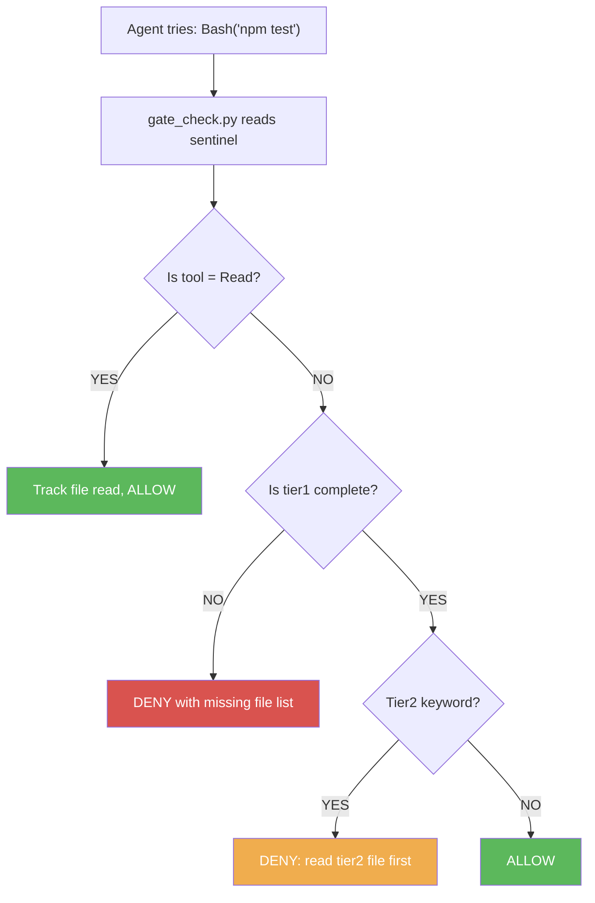
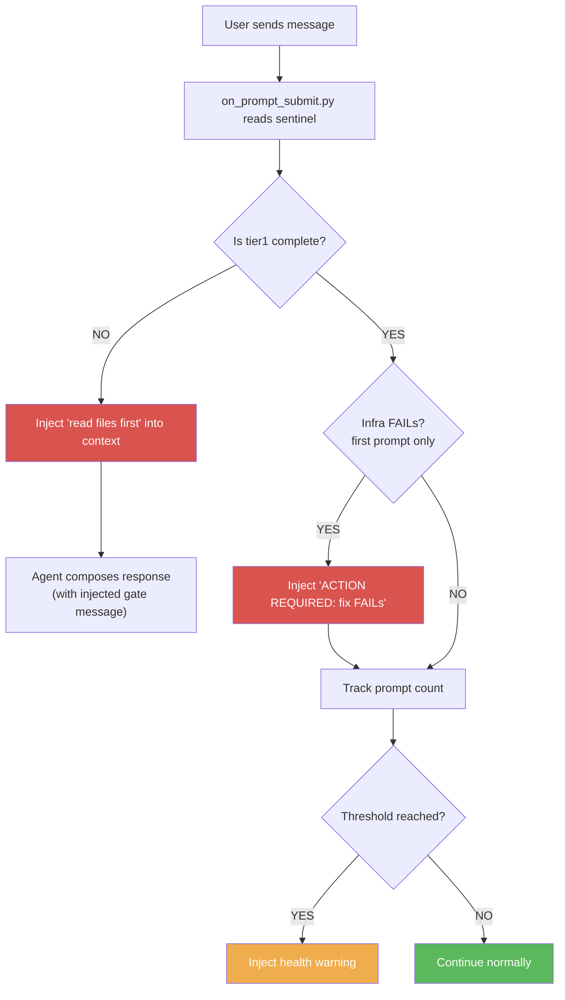

# Module 4: Adding Gates

**Time:** 20 minutes
**Goal:** Add structural enforcement — the agent cannot use any tool until
all tier1 files are read. Add prompt-level gate as a second layer.

---
!!! tip "Using SQLite instead of YAML?"
    This module shows YAML examples. If you chose SQLite in the setup wizard,
    see the [Data Store Mapping Guide](../reference/data-store-mapping.md) for
    equivalent database commands.

------|------|-------------|
| Tool Gate | PreToolUse | Blocks Bash, Write, Edit, Agent — only allows Read |
| Prompt Gate | UserPromptSubmit | Injects "read files first" into the agent's context |

Together, these create a two-layer defense:
- **Tool Gate** prevents the agent from doing work without rules
- **Prompt Gate** prevents the agent from responding without rules

---

## Step 1: Install the Gate Scripts (3 minutes)

If you used `setup.py` with Level 2+, these are already installed. Otherwise:

```bash
cp path/to/agentic-ai-tiered-startup/hooks/gate_check.py .agent/hooks/
cp path/to/agentic-ai-tiered-startup/hooks/on_prompt_submit.py .agent/hooks/
```

## Step 2: Enable Gates in Config (2 minutes)

Update `startup-config.yaml`:

```yaml
gates:
  block_until_tier1: true          # ← Changed from false to true
  tier2_keyword_scan: false        # We'll enable this in Module 5
  prompt_health_warnings: [40, 60, 80]
```

## Step 3: Wire the Hooks (3 minutes)

Update `.agent/settings.json`:

```json
{
  "hooks": {
    "SessionStart": [
      {
        "matcher": "",
        "hooks": [{
          "type": "command",
          "command": "python3 .agent/hooks/on_session_start.py",
          "timeout": 60000
        }]
      }
    ],
    "PreToolUse": [
      {
        "matcher": "",
        "hooks": [{
          "type": "command",
          "command": "python3 .agent/hooks/gate_check.py",
          "timeout": 5000
        }]
      }
    ],
    "UserPromptSubmit": [
      {
        "matcher": "",
        "hooks": [{
          "type": "command",
          "command": "python3 .agent/hooks/on_prompt_submit.py",
          "timeout": 5000
        }]
      }
    ]
  }
}
```

## Step 4: Test the Gates (5 minutes)

Start a new session. Before the agent reads any tier1 files:

1. **Try asking the agent to run a command** — the Tool Gate should block it:
   ```
   DENIED: Tier 1 startup incomplete. Still need to read: core-rules, infra-report
   ```

2. **the agent sees the Prompt Gate message:**
   ```
   STARTUP INCOMPLETE: 2 Tier 1 files still unread.
   Read these files BEFORE responding to the user.
   ```

3. **After the agent reads all tier1 files** — tools are unblocked and work normally.

---

## How It Works

### The Tool Gate Flow



**Key insight:** Read is always allowed. That's how the agent loads the tier1
files that unlock everything else. The gate is a one-way door: once tier1
is complete, it stays complete for the rest of the session.

**Git commit passthrough:** `git commit` and `git push` commands are
auto-allowed even during the `tier1_pending` state. Version control should
never be blocked — the agent needs to be able to commit fixes discovered
during startup without waiting for all tier1 files to load.

### The Prompt Gate Flow



**Key insight:** The Prompt Gate has three layers of enforcement:
1. **Tier 1 gate** — blocks until all files are read
2. **Infra FAIL gate** — forces the agent to fix infrastructure problems before responding
3. **Health warnings** — alerts when context is degrading

Even if the agent somehow bypasses the Tool Gate, the Prompt
Gate ensures the agent sees "read files first" before every response. Two
independent enforcement mechanisms.

### Infrastructure FAIL Gate

After startup completes, the Prompt Gate checks the infra report for any
`[FAIL]` results — but only on the **first prompt** of the session. If
FAILs are found, it injects an action-required message:

```
ACTION REQUIRED: 1 infrastructure FAIL(s) detected.
You MUST fix these BEFORE responding to the user:
  - [FAIL] Check repos clean: 1 uncommitted file
Fix each one (commit, resolve, or explain why acceptable),
then confirm 0 FAIL before proceeding.
```

**Why this matters:** Without this gate, the agent reads the infra report
(which contains the FAIL), but the FAIL is buried among hundreds of lines
of other tier1 content. The agent routinely ignores it and proceeds with
the user's request. The gate surfaces the FAIL at the top level where
it cannot be missed.

**Design choices:**
- **First prompt only** — uses a flag file to avoid repeating every message.
  Once the agent sees the FAIL, it either fixes it or explains why. Repeating
  the warning on every prompt would be noisy.
- **Soft enforcement** — the gate injects context but doesn't block tools.
  The agent *should* fix the FAIL before responding, but isn't mechanically
  prevented from proceeding. This is intentional: some FAILs require user
  input (e.g., "should I commit this file?") and hard-blocking would deadlock.
- **Parses the infra report file** — the same file generated by the
  SessionStart hook. No duplicate logic.

### Context Health Warnings

After startup completes, the Prompt Gate tracks how many messages have
been exchanged. At configured thresholds (default: 40, 60, 80), it
injects a warning:

```
CONTEXT HEALTH: 60 prompts this session. Performance may be degrading.
Consider saving state and starting fresh with /clear.
```

This prevents the silent quality degradation that happens in long sessions.

---

## File Read Tracking

The gate tracks which files the agent has read by matching file paths.
When the agent uses the Read tool on a file, the gate compares the path
against all manifest entries.

```python
# Simplified logic in gate_check.py
if tool_name == "Read":
    file_path = tool_input["file_path"]
    for entry in manifest["tier1"]:
        if file_path.endswith(os.path.basename(entry["path"])):
            sentinel["completed_reads"].append(entry["name"])
```

Once all tier1 names appear in `completed_reads`, the sentinel stage
flips to `"complete"` and tools are unblocked.

---

## Troubleshooting

### the agent is stuck in a loop trying to read files
The gate might not be recognizing the file reads. Check:
- Is the file path in the manifest correct?
- Did the agent read the file at the exact path listed in the manifest?
- Check the sentinel: `cat /tmp/startup-complete-*.json`

### Gate blocks everything including Read
The gate should never block Read. If it does, check:
- Is `gate_check.py` checking `tool_name == "Read"` before other gates?
- Is the script getting valid JSON on stdin?

### Prompt Gate fires after startup is complete
Check the sentinel file — is `stage` set to `"complete"`?
The Prompt Gate reads the sentinel independently from the Tool Gate.

---

## Context Reset Detection (`/clear` Gate)

When a user runs `/clear` (or an equivalent context-reset command), the
conversation is wiped but the session process continues. This creates a
dangerous mismatch:

- **Sentinel** says startup is complete (it persists in `/tmp`)
- **Agent context** is empty (all loaded rules, facts, and learnings are gone)
- **Tool Gate** allows everything (sentinel says "complete")
- **Result:** Agent operates without any loaded rules — exactly the state
  the tiered startup architecture exists to prevent

### How It Works

The Prompt Gate (`on_prompt_submit.py`) detects the mismatch using two signals:

1. **Prompt counter vs transcript length** (Claude Code): The hook tracks
   a prompt counter in `/tmp`. After `/clear`, the counter is high (e.g., 50)
   but the transcript from stdin has 0-1 messages. This mismatch means
   the context was reset mid-session.

2. **Tool-agnostic fallback**: For non-Claude tools, extend `detect_context_reset()`
   with your tool's context-awareness API (e.g., conversation ID change,
   context length query, session state endpoint).

When detected, the hook:

1. Deletes the sentinel, prompt counter, and infra-fail flag
2. Re-runs the SessionStart hook to regenerate manifest and tier files
3. Injects a "CONTEXT RESET DETECTED" message telling the agent to re-read tier1

The existing Tool Gate then blocks non-Read tools until all tier1 files
are read again — the same flow as a fresh session.

### Adapting for Other Tools

The detection is in a single function: `detect_context_reset()` in
`hooks/on_prompt_submit.py`. The Claude Code implementation checks
`hook_input["transcript"]`. For other tools:

```python
# Example: tool that exposes conversation ID
def detect_context_reset(hook_input):
    sentinel = read_json(SENTINEL)
    if not sentinel or sentinel.get("stage") != "complete":
        return False

    current_conv_id = hook_input.get("conversation_id")
    saved_conv_id = sentinel.get("conversation_id")
    if current_conv_id and saved_conv_id and current_conv_id != saved_conv_id:
        return True

    return False
```

The rest of the flow (sentinel deletion, startup re-trigger, tool gate
blocking) is tool-agnostic and works unchanged.

---

## Checkpoint

Before moving on, verify:
- [ ] Starting a session without reading tier1 → tools are blocked
- [ ] Reading all tier1 files → tools are unblocked
- [ ] If an infra check FAILs → "ACTION REQUIRED" message appears on first prompt
- [ ] At 40+ prompts, a health warning appears
- [ ] The sentinel shows `stage: "complete"` after all files are read
- [ ] After `/clear`, the agent is forced to re-read tier1 before proceeding

---

**Next:** [Module 5 — On-Demand Loading & Drift Detection](module-5-advanced.md)
