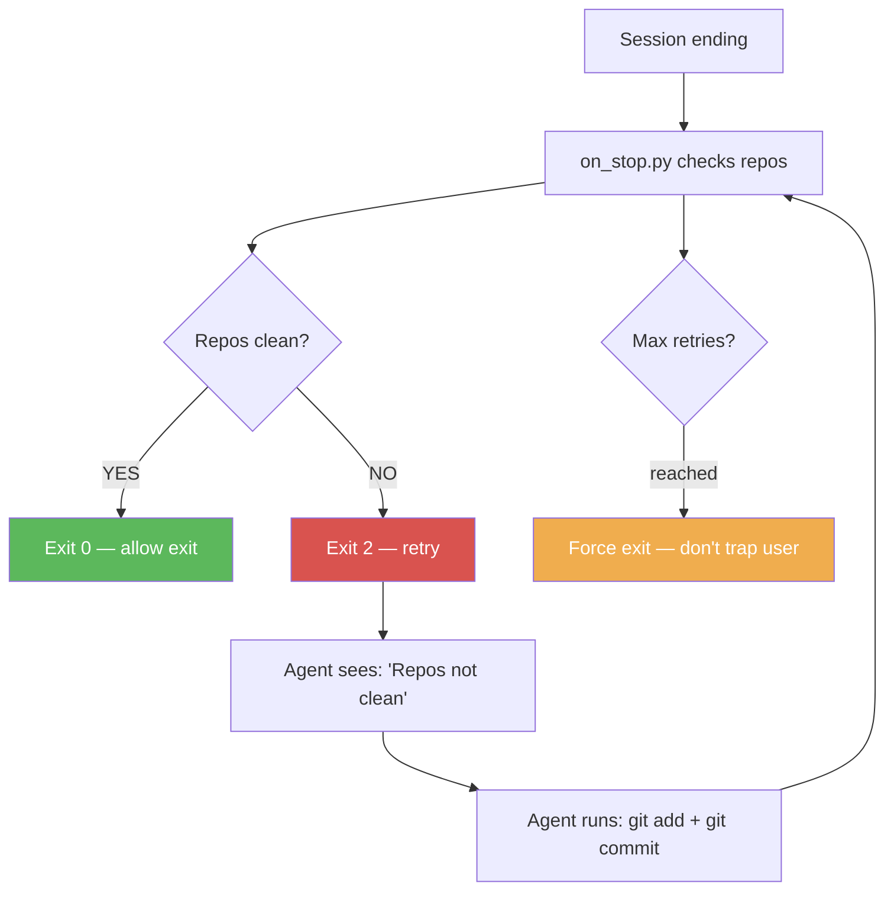
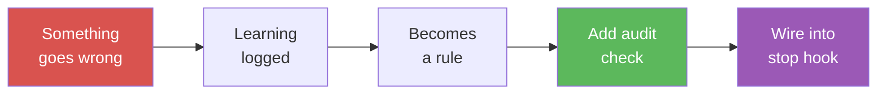

# Module 5: On-Demand Loading & Drift Detection

**Time:** 20 minutes
**Goal:** Add tier2 keyword triggers, cross-check drift detection,
PostToolUse actions, and the stop hook.

---
!!! tip "Using SQLite instead of YAML?"
    This module shows YAML examples. If you chose SQLite in the setup wizard,
    see the [Data Store Mapping Guide](../reference/data-store-mapping.md) for
    equivalent database commands.

---

## Part B: Cross-Check Drift Detection

### The Concept

After tier1 loads, run a one-time check comparing expected state
(from your config) against actual state (from live commands). This
catches drift that would otherwise go unnoticed.

### Step 1: Define Expectations

Add to `startup-config.yaml`:

```yaml
cross_check:
  expected_counts:
    rule_file_count:
      command: "find rules/ -name '*.md' | wc -l | tr -d ' '"
      expected: 3
      auto_heal: false

    test_count:
      command: "find tests/ -name 'test_*.py' | wc -l | tr -d ' '"
      expected: 12
      auto_heal: false
```

### Step 2: How It Runs

The gate_check.py script automatically invokes cross_check.py after
tier1 completes — once per session:

1. **Pass 1:** Run each command, compare output to expected value
2. **Auto-heal** safe items (if configured with `auto_heal: true`)
3. **Pass 2:** Re-check healed items to confirm the fix worked
4. **Write-back suggestions:** For persistent drift, generate
   `write_back_suggestions` proposing manifest updates or flagging
   items for investigation (structurally enforces the
   [Self-Healing Loop](../reference/self-healing-loop.md) pattern)
5. **Stop** — no more passes (bounded, prevents infinite loops)

Results are logged to the sentinel and reported:

```
Cross-check: 2/2 passed
```

Or if drift is found:

```
Cross-check: 1/2 passed, 1 DRIFTED
  DRIFT: rule_file_count: expected 3, got 5
```

### When to Use Auto-Heal

- **Safe:** Updating a count in a config file
- **Unsafe:** Deleting files, modifying code, running migrations
- **Rule:** If the fix could cause damage, set `auto_heal: false`
  and let the human decide

---

## Part C: PostToolUse Hook

### The Concept

After every Write or Edit, run automated actions:
- Sync important files to backup locations
- Track edit count for save reminders
- Detect stale references (advanced)

### Setup

If you used `setup.py` with Level 4, this is already installed. Otherwise:

```bash
cp path/to/agentic-ai-tiered-startup/hooks/on_edit.py .agent/hooks/
```

Add to `.agent/settings.json`:

```json
"PostToolUse": [
  {
    "matcher": "Write|Edit",
    "hooks": [{
      "type": "command",
      "command": "python3 .agent/hooks/on_edit.py",
      "timeout": 5000
    }]
  }
]
```

The default on_edit.py provides periodic save reminders (every 15 edits)
and structurally enforces the [Rule Zero](../reference/rule-zero.md)
pattern: it scans edited files for keyword overlap with consolidated
files and warns if content appears scattered. Customize it to add file
sync or other post-write actions.

**DB mode:** When `AGENT_DB_PATH` is set, every edit is also logged to
the `rule_log` table — enabling session activity reports and edit count
tracking at shutdown.

---

## Part D: Stop Hook

### The Concept

Block session exit until cleanup is done. The stop hook returns exit
code 2 (retry) when checks fail, giving Claude a chance to fix the
issue. After max retries, it exits cleanly. The stop hook also
structurally enforces [Self-Verification](../reference/self-verification.md):
if infrastructure files were edited after the last infrastructure check,
exit is blocked until re-verification runs.

### Setup

```bash
cp path/to/agentic-ai-tiered-startup/hooks/on_stop.py .agent/hooks/
```

Add to config:

```yaml
stop:
  require_clean_repos: true
  require_transcript: false
  require_audit_pass: true    # run audit checks before exit
  max_retries: 8
  shutdown_steps:              # custom checks before exit (same validators as startup)
    - name: lint-clean
      command: "npm run lint 2>&1 | tail -1"
      validator: "contains:no errors"
      fail_message: "Linter has errors"
```

`shutdown_steps` uses the same validator registry as startup checks
(`empty_output`, `contains:text`, `equals:text`, `regex:pattern`).
Each step runs before exit; failures trigger retry (exit code 2).

**DB mode:** Add `require_session_summary: true` to require a
`session_summaries` row before exit — ensures session learnings are captured.

Wire in settings:

```json
"Stop": [
  {
    "matcher": "",
    "hooks": [{
      "type": "command",
      "command": "python3 .agent/hooks/on_stop.py",
      "timeout": 10000
    }]
  }
]
```

### How Retries Work



Max retries prevents the user from being trapped if the check can't
be satisfied.

### Audit Runner Integration

The stop hook can also run the [Audit Runner](../reference/audit-runner.md)
before allowing exit. Enable with `require_audit_pass: true` in your config.
This catches infrastructure drift introduced during the session.

Every audit check was born from a real failure:



See the [full check library](../reference/audit-runner.md#check-library-reference)
for all 22 checks with "What It Catches / Why It Matters" tables.

**DB mode note:** When using SQLite, the stop hook also enforces no-truncation — it verifies stored rule content length matches the source, blocking exit if any rule was silently truncated during a batch insert.

---

## What You've Built (Full Level 4)

```
Session start → SessionStart hook
  → Checks infrastructure
  → Generates tier1 + tier2 files
  → Writes manifest + sentinel
       │
Every user message → UserPromptSubmit hook
  → Blocks until tier1 complete
  → Warns at prompt thresholds
       │
Every tool call → PreToolUse hook
  → Blocks non-Read until tier1 complete
  → Auto-allows git commit/push (version control never blocked)
  → Runs cross-check once
  → Triggers tier2 on keywords
       │
Every Write/Edit → PostToolUse hook
  → Save reminders
  → Rule Zero enforcement (scattered content detection)
  → File sync (if configured)
       │
Session end → Stop hook
  → Blocks until repos clean
  → Runs audit checks (if require_audit_pass)
  → Self-verification enforcement
  → Retries up to N times
```

---

## Part E: Session Continuity

Agent sessions are ephemeral — tasks, progress, and "what's next"
vanish when the session ends. Session continuity solves this with
two features:

1. **Persistent Backlog** — todos stored in a file or database that
   survives across sessions, loaded into Tier 1 at startup
2. **Session Handoff** — each session records what was done and what's
   next, so the following session picks up where the last one left off

**Why this matters:** Without continuity, users re-explain context
every session. With it, the agent says "Last session worked on auth
refactor. Next items: fix flaky test, update docs" — and starts working.

Two implementation methods:
- **JSON file** — simple, zero dependencies, good for under ~20 tasks
- **SQLite** — queryable, handles concurrency, tracks history

See the full **[Session Continuity Guide](../reference/session-continuity.md)**
for setup instructions, code examples for both methods, and stop hook
integration for automatic session handoff.

---

## Checkpoint

- [ ] Tier 2 triggers fire when keywords appear in commands
- [ ] Cross-check runs after tier1 completes (check sentinel for `cross_check_done: true`)
- [ ] Save reminder appears after 15 edits
- [ ] Stop hook blocks exit when repos are dirty
- [ ] Backlog loads in tier1 at session start (JSON or SQLite method)

---

**Next:** [Module 6 — Anti-Hallucination Rules](module-6-anti-hallucination.md)
