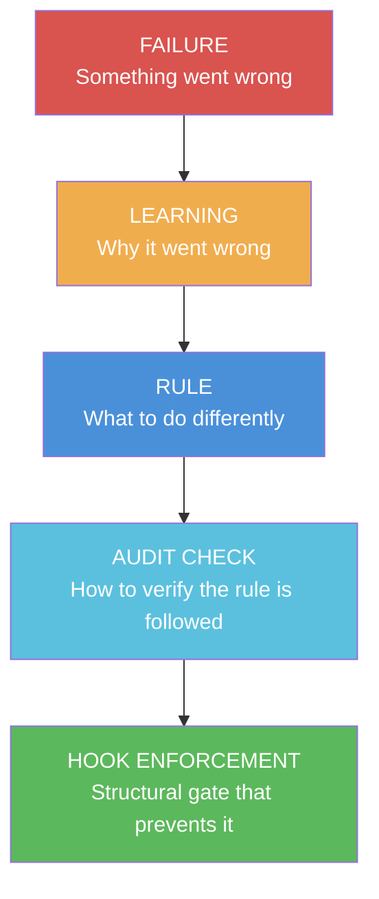
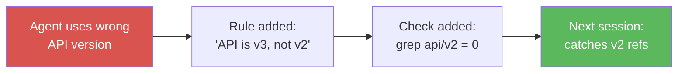
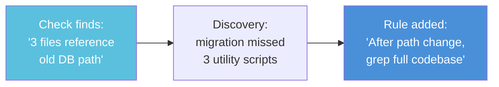

# Module 7: The Feedback Loop

**Time:** 15 minutes
**Goal:** Build a self-improving system where failures become rules,
rules become checks, and checks become structural enforcement.

---
!!! tip "Using SQLite instead of YAML?"
    This module shows YAML examples. If you chose SQLite in the setup wizard,
    see the [Data Store Mapping Guide](../reference/data-store-mapping.md) for
    equivalent database commands.

---

## The Evolution Chain



Not every failure needs all 5 steps. Most need at least a learning and
a rule. The progression to audit checks and hooks is for repeat failures.

---

## Step 1: Capture Failures Immediately

When the agent makes a mistake, write it down before fixing it:

```markdown
**What happened:** [Factual description]
**What was expected:** [Correct behavior]
**Root cause:** [Why — ask "why" 3 times]
```

**Example:**
```markdown
**What happened:** the agent used Jest syntax but project uses Vitest
**What was expected:** import { describe, it, expect } from 'vitest'
**Root cause:** No rule specifying test framework. Project README mentions
Jest in the "migrating from" section, which Claude picked up as current.
```

## Step 2: Write the Rule

Use the template from the [Rule Evolution document](../reference/rule-evolution-template.md):

```markdown
### test-framework
Tests use Vitest, not Jest. The README mentions Jest in the migration
section — that's historical, not current.

- DO: import from 'vitest'
- DON'T: import from '@jest/globals'

**Why:** the agent used Jest syntax 3 times because the migration docs
mention Jest. The project fully migrated to Vitest in March.
**How to apply:** Before writing any test, check existing tests for
the import pattern.
```

Add to your `rules/core-rules.md` file.

## Step 3: Ask the Audit Question

After writing any rule, ask:

> "Can I verify this rule is being followed with a command?"

If yes, add a check to `startup-config.yaml`:

```yaml
checks:
  - name: no-jest-imports
    command: "grep -r 'from.*jest' tests/ | wc -l | tr -d ' '"
    validator: "equals:0"
    fail_message: "Jest imports found in test files"
```

If no (the rule requires human judgment), it stays as a rule only.

## Step 4: Escalate if Needed

If the same failure happens **3+ times despite the rule being loaded**,
escalate to hook enforcement:

```python
# In gate_check.py — custom gate
if tool_name == "Write" and "from '@jest" in tool_input.get("content", ""):
    deny("BLOCKED: Use Vitest, not Jest. See rule: test-framework")
```

This is the nuclear option — use it sparingly. Most failures are fixed
by having the rule loaded (step 2). Hook enforcement is for rules that
the agent repeatedly violates even when they're in context.

---

## The Bidirectional Flow

The feedback loop works in two directions:

### Forward: Failure → Rule → Check



### Backward: Check → Discovery → Rule



The checks don't just verify — they find new issues that become new rules.

---

## Rule Hygiene

### Merge

If you have three rules about the same topic, merge them:
```
Before: "Use pnpm" + "Don't use npm" + "Don't use yarn"
After:  "Package manager is pnpm. Not npm, not yarn."
```

### Promote

If a tier2 rule triggers in >50% of sessions, move it to tier1.
If a rule is violated 3+ times, escalate to a hook gate.

### Retire

Remove rules that:
- Haven't triggered in 20+ sessions (too specific)
- Are now enforced by linters or CI (redundant)
- Reference things that no longer exist in the project

### The 80/20 Target

Most projects need:
- **5-10 tier1 rules** (core conventions, active project state)
- **10-20 tier2 rules** (task-specific, keyword-triggered)
- **3-5 infrastructure checks** (verifiable project state)
- **0-2 hook gates** (only for critical, repeatedly-violated rules)

If your tier1 has 50+ rules, you're probably including things the
codebase already communicates.

---

## Exercise: Build Your First Loop

1. **Think of the last mistake** Claude made in your project
2. **Write the learning** (what happened, why)
3. **Write the rule** (using the template)
4. **Ask the audit question** (can I verify this with a command?)
5. **Add the check** if possible
6. **Commit and push** the updated rules file

Congratulations — you've completed one cycle of the feedback loop.
Every future failure gets the same treatment: capture → rule → check.

---

## Key Principle

> "Rules that exist 'just in case' get ignored. Rules born from
> real failures get followed."

Don't write rules for hypothetical scenarios. Write rules for things
that actually went wrong. The system grows from real experience, not
from imagining what might happen.

---

## Advanced Patterns (Structurally Enforced)

These three patterns make the feedback loop self-sustaining. All three
are now structurally enforced via hooks — not just behavioral guidelines.
Read them after completing the basics above:

1. **[Rule Zero](../reference/rule-zero.md)** — every file edit triggers
   "is this scattered information?" and routes it to the right file.
   Structurally enforced: the `on_edit.py` PostToolUse hook scans
   edited files for keyword overlap with consolidated files and warns
   if content appears scattered.

2. **[Self-Healing Loop](../reference/self-healing-loop.md)** — the
   bidirectional flow where rules feed audit checks AND audit checks
   feed rules. Structurally enforced: `cross_check.py` generates
   `write_back_suggestions` for persistent drift, and the standalone
   [Audit Runner](../reference/audit-runner.md) (`audit.py`) provides
   on-demand check execution integrated with the stop hook.

3. **[Self-Verification](../reference/self-verification.md)** — the
   4-point check that proves work is actually done, not just narrated
   as done. Structurally enforced: `on_stop.py` blocks session exit if
   infrastructure files were edited after the last infrastructure check,
   requiring re-verification before the session can end.

---

## The Full Check Library

The [Audit Runner](../reference/audit-runner.md#check-library-reference) ships
with 22 checks across 4 categories — every one born from a real failure.
See the full "What It Catches / Why It Matters" tables in the reference docs.

## Checkpoint

- [ ] You've written at least one rule from a real failure
- [ ] You've added at least one infrastructure check
- [ ] You understand when to escalate a rule to a hook gate
- [ ] You know when to retire a rule
- [ ] You've read Rule Zero and understand the routing pattern (enforced by `on_edit.py`)
- [ ] You've read the Self-Verification 4-point check (enforced by `on_stop.py`)
- [ ] You've reviewed the [audit check library](../reference/audit-runner.md) and customized for your project

---

**Next:** [Module 8 — Capstone: Wire It All Together](module-8-capstone.md)
