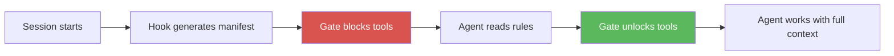

# Agentic AI Tiered Startup Architecture

A progressive, hook-based system that ensures AI agent sessions start with
the right context loaded, enforced structurally — not by hoping the agent reads
your instructions carefully.

---

## What You'll Achieve

By adopting this architecture, your AI agent sessions will:

<div class="grid cards" markdown>

-   :material-shield-check:{ .lg .middle } **Consistent startup, every session**

    ---

    No more "did the agent load the rules?" guessing. Structural gates block
    all tool use until critical context is loaded — verified by file-read tracking,
    not trust.

-   :material-lightning-bolt:{ .lg .middle } **50%+ token savings**

    ---

    Tiered loading means only essential rules load every session. Specialized rules
    (API guidelines, deploy procedures) load on-demand when trigger keywords appear.

-   :material-sync:{ .lg .middle } **Zero stale references**

    ---

    Drift detection automatically catches when your instructions say "58 rules" but
    the source has 62. Self-healing corrects what it can; flags what it can't.

-   :material-alert-circle-check:{ .lg .middle } **Infrastructure problems caught immediately**

    ---

    Failed checks (dirty repos, broken venvs, missing credentials) surface as
    ACTION REQUIRED messages the agent must fix before responding.

-   :material-brain:{ .lg .middle } **Research-backed anti-hallucination rules**

    ---

    14 cognitive rules organized into 5 phases, each citing peer-reviewed research.
    Reduces hallucination in LLM summaries by addressing the root causes.

-   :material-cog-sync:{ .lg .middle } **Self-improving feedback loop**

    ---

    Every failure becomes a rule. Every rule gets an audit check. Every audit check
    feeds back into the rules. The system learns from its own mistakes.

</div>

---

## The Core Idea

AI agents are powerful but forgetful. They don't reliably read your project
instructions, they skip rules buried in long files, and they start working
before critical context is loaded. Writing "you MUST read X first" in a
markdown file is documentation, not enforcement.

This architecture replaces hope with hooks:



Four hook points — **SessionStart**, **PreToolUse**, **UserPromptSubmit**, and **Stop** —
create a structural enforcement layer that works regardless of the agent's
instruction-following quality.

---

## Where to Start

| You want to... | Go here |
|----------------|---------|
| Understand the problem | [The Problem](overview/the-problem.md) |
| See the architecture | [Architecture Overview](overview/architecture.md) |
| Get running in 2 minutes | [Setup Wizard](reference/setup-wizard.md) |
| Learn step by step | [Mini Course](course/README.md) (8 modules, ~2.5 hours) |
| See it visually | [Slide Deck](slides.md) |
| Just want the code | `git clone` and run `python3 setup.py` |

---

## Quick Setup

```bash
git clone https://github.com/dexmaddy/agentic-ai-tiered-startup.git
cd agentic-ai-tiered-startup
python3 setup.py
```

The interactive wizard configures everything for your agent platform
(Claude Code, Cursor, Windsurf, Aider) and project in under 2 minutes.

---

## Platform Support

The **concepts** apply to any AI agent system. The **reference implementation**
uses Claude Code hooks, but adapts to any platform with lifecycle events.

| Platform | Status |
|----------|--------|
| Claude Code | Full hook support — use as-is |
| Cursor | Rules via `.cursor/rules/`, gates via custom commands |
| Windsurf | Rules via `.windsurfrules`, state via Cascade memories |
| Aider | Rules via `--read` flag, config via `.aider.conf.yml` |
| LangChain / CrewAI | Startup node + gate callback in agent loop |
| Custom agents | Implement hooks as middleware |
