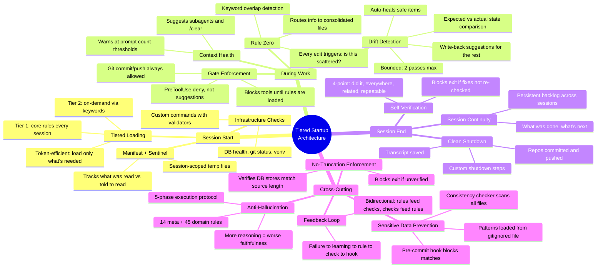
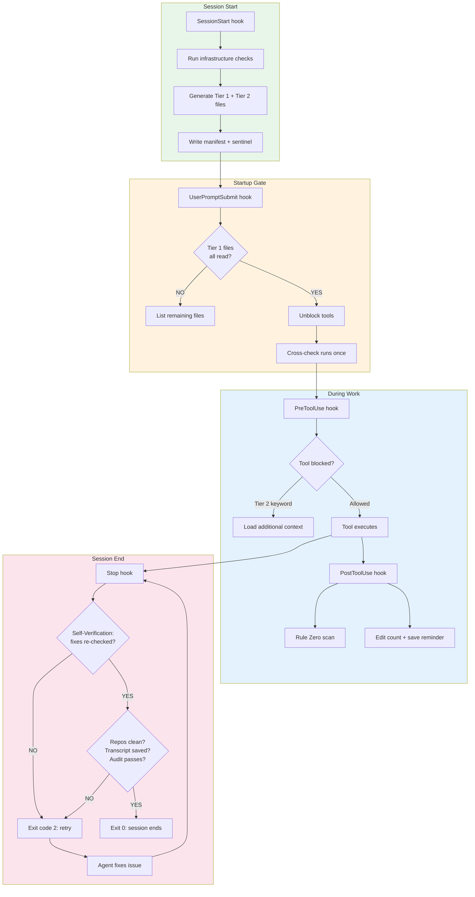
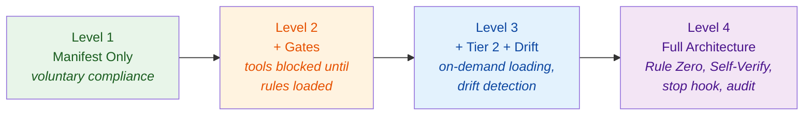

# What It Does For You

A complete map of capabilities — what fires, when, and what it prevents.

---

## The Full Picture

---

## Lifecycle: When Each Capability Fires

---

## Capability Reference

| Capability | What It Does | Hook / Component | Level |
|-----------|-------------|-----------------|-------|
| **Infrastructure Checks** | Validates DB, git, venv, custom commands at startup | `on_session_start.py` | 1 |
| **Tiered Loading** | Loads core rules always, task-specific rules on demand | `on_session_start.py` | 1 |
| **Manifest + Sentinel** | Tracks session state, file reads, stage progression | `on_session_start.py` | 1 |
| **Gate Enforcement** | Blocks non-Read tools until Tier 1 is loaded | `gate_check.py` | 2 |
| **Prompt Health** | Warns at configurable prompt count thresholds | `on_prompt_submit.py` | 2 |
| **Context Reset Detection** | Detects `/clear` and re-triggers startup | `on_prompt_submit.py` | 2 |
| **Tier 2 Keyword Triggers** | Scans tool inputs for task keywords, loads matching files | `gate_check.py` | 3 |
| **Drift Detection** | Compares expected counts against live state | `cross_check.py` | 3 |
| **Auto-Heal** | Fixes safe drift items automatically (bounded, 2 passes) | `cross_check.py` | 3 |
| **Write-Back Suggestions** | Proposes manifest updates for persistent drift | `cross_check.py` | 3 |
| **Rule Zero** | Scans edited files for scattered content, warns to consolidate | `on_edit.py` | 4 |
| **Edit Tracking** | Counts edits, periodic save reminders | `on_edit.py` | 4 |
| **Self-Verification** | Blocks exit if infrastructure was edited but not re-checked | `on_stop.py` | 4 |
| **Clean Shutdown** | Requires clean repos, transcript, audit pass before exit | `on_stop.py` | 4 |
| **Session Continuity** | Persistent backlog (JSON or DB) loaded at startup | `backlog.json` / DB | 4 |
| **No-Truncation** | Verifies DB stores weren't silently truncated | `on_stop.py` | 4 |
| **Audit Runner** | On-demand infrastructure checks, same validators as startup | `audit.py` | 4 |
| **Sensitive Data Scan** | Pre-commit hook + consistency checker block personal data | `pre-commit` + `consistency_check.py` | 4 |
| **Anti-Hallucination Rules** | 59 rules in 5 phases for faithful LLM outputs | `rules/` + DB | Any |
| **Feedback Loop** | Failure → Learning → Rule → Check → Hook evolution | Pattern | Any |

---

## What Problem Does Each Capability Solve?

!!! tip "Read this column when deciding what to enable"

| Capability | Without It | With It |
|-----------|-----------|---------|
| Gate Enforcement | Agent starts working before loading rules — applies defaults, not your conventions | Tools blocked until rules are in context — every session starts with full knowledge |
| Rule Zero | Information scatters across files and conversations, lost at session end | Every edit is categorized and routed — nothing gets lost |
| Self-Verification | Agent says "done" but the fix wasn't tested | Exit blocked until verification re-runs — "done" means verified |
| Drift Detection | Config says 3 rules but you have 5 — silent mismatch grows | Expected vs actual compared every session — drift caught early |
| Anti-Hallucination | LLM adds plausible but unsourced details to summaries | 59 rules enforce source-faithful extraction — retract if no quote |
| Feedback Loop | Same mistakes repeat across sessions | Each failure becomes a rule, each rule becomes a check — system learns |
| Session Continuity | User re-explains context every session | Agent picks up where last session left off — backlog persists |
| Sensitive Data Scan | Personal data accidentally committed to public repos | Pre-commit hook + scanner block matches before they reach git |

---

## Adoption Levels

Start with Level 1 and grow as needed. Each level adds capabilities without
breaking previous ones.

---

**Ready to set it up?** Run the [Setup Wizard](../reference/setup-wizard.md)
to generate your configuration at your chosen level.
