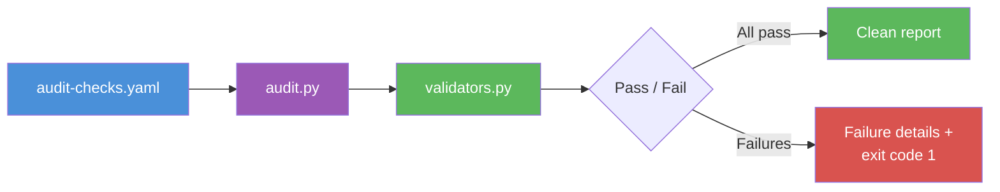

# Audit Runner: On-Demand Infrastructure Checks

A standalone tool for running infrastructure and quality checks outside
of the startup sequence. Uses the same validator framework as startup,
so checks written for one work in both.

---

## What It Does

The audit runner executes a set of YAML-defined checks against your
project, reports pass/fail status, and optionally blocks session exit
if critical checks fail. It complements the startup checks by providing
an on-demand execution path — run checks whenever you need them, not
just at session start.



## Running Standalone

```bash
# Run all checks
python3 hooks/audit.py

# Custom checks file
python3 hooks/audit.py --checks path/to/checks.yaml

# Verbose output (show passing checks too)
python3 hooks/audit.py --verbose

# Only run checks marked critical
python3 hooks/audit.py --critical-only
```

## YAML Check Schema

Each check entry supports the following fields:

```yaml
checks:
  - name: no-stale-imports          # Unique identifier (required)
    command: "grep -r 'old_module' src/ | wc -l | tr -d ' '"  # Shell command (required)
    validator: "equals:0"           # Validator expression (required)
    description: "Ensure no imports from deprecated module"    # Human-readable (optional)
    phase: 4                        # Grouping hint (optional)
    critical: true                  # Blocks stop hook if true (optional, default false)
    optional: false                 # Skipped failures are warnings only (optional)
```

**Validators** are the same expressions used by startup checks (see
`validators.py`). Common validators:

| Validator | Meaning |
|-----------|---------|
| `equals:0` | Command output must be exactly `0` |
| `equals:OK` | Command output must be exactly `OK` |
| `min:1` | Numeric output must be at least 1 |
| `contains:success` | Output must contain the substring `success` |
| `not_empty` | Output must not be blank |

## Stop Hook Integration

When `stop.require_audit_pass` is enabled in your startup config, the
stop hook runs the audit checks before allowing session exit. Critical
check failures block the exit and require resolution.

```yaml
# In startup-config.yaml
stop:
  require_audit_pass: true
```

This ensures that infrastructure drift introduced during a session is
caught before the session closes — not discovered at the next startup.

## Adding Custom Checks

Add entries to your `audit-checks.yaml` file. No code changes needed.

1. Write a shell command that produces measurable output
2. Choose a validator expression that defines "pass"
3. Add the entry to the YAML file
4. Run `python3 hooks/audit.py --verbose` to verify

```yaml
# Example: ensure all migration files have a rollback function
- name: reversible-migrations
  command: >
    for f in migrations/*.py; do
      grep -L 'def down' "$f";
    done | wc -l | tr -d ' '
  validator: "equals:0"
  description: "All migrations must have a down() function"
  critical: true
```

## Relationship to Self-Healing Loop

The audit runner is the **check** side of the
[Self-Healing Loop](self-healing-loop.md). While the loop describes
the bidirectional feedback pattern (rules feed checks, checks feed
rules), the audit runner is the concrete tool that executes those
checks on demand. New rules that imply verifiable constraints flow
into `audit-checks.yaml` via the forward flow; audit findings that
reveal gaps flow back into rules via the backward flow.
