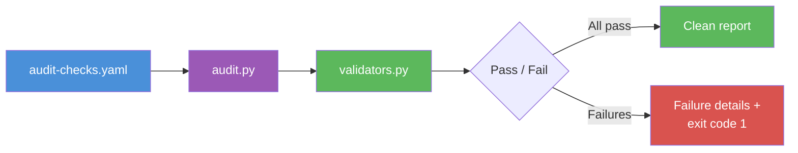
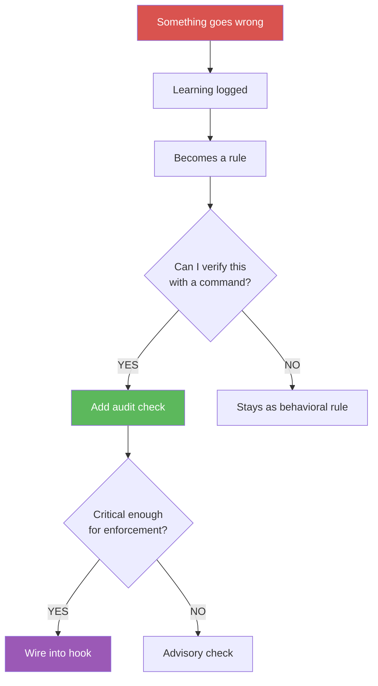
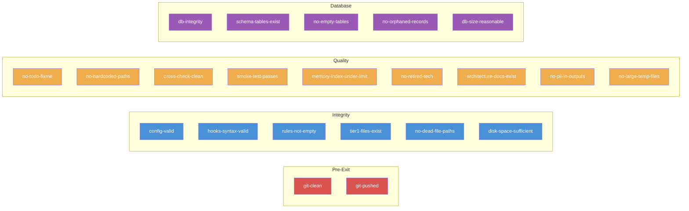

# Audit Runner: On-Demand Infrastructure Checks

A standalone tool for running infrastructure and quality checks outside
of the startup sequence. Uses the same validator framework as startup,
so checks written for one work in both.

## How It Works



## Running Standalone

```bash
# Run all checks
python3 hooks/audit.py

# Custom checks file
python3 hooks/audit.py --checks path/to/checks.yaml

# Verbose output (show passing checks too)
python3 hooks/audit.py --verbose

# Only run checks marked critical
python3 hooks/audit.py --critical-only

# Merge generic + DB checks
python3 hooks/audit.py --checks checks/audit-checks.yaml --merge checks/audit-checks-db.yaml
```

## Check Library Reference

### How Checks Are Born



Every check in this library was born from a real failure. The tables below show what each catches and why it matters.

### Check Categories



### Pre-Exit Checks

These run before session end. Failures here mean work could be lost.

| Check | What It Catches | Why It Matters | Critical |
|-------|----------------|----------------|:--------:|
| `git-clean` | Uncommitted changes left in working tree | Work lost when session ends; next session starts dirty | Yes |
| `git-pushed` | Commits exist locally but not on remote | Collaborators can't see changes; single point of failure | Yes |

### Integrity Checks

These verify the system's own infrastructure is sound.

| Check | What It Catches | Why It Matters | Critical |
|-------|----------------|----------------|:--------:|
| `config-valid` | Startup config has YAML syntax errors | Session start fails silently; agent runs without rules | Yes |
| `hooks-syntax-valid` | Hook scripts have Python syntax errors | Hooks fail silently; enforcement stops working | Yes |
| `rules-not-empty` | Rule files exist but contain no content | Agent loads empty rules; behaves as if unconstrained | Yes |
| `tier1-files-exist` | Config references files that don't exist on disk | Startup generates incomplete tier1; gaps in context | Yes |
| `no-dead-file-paths` | Config or index references deleted/moved files | Stale pointers cause silent load failures | Yes |
| `disk-space-sufficient` | Less than 500MB free on project disk | Writes fail silently; DB corruption; incomplete saves | Yes |

### Quality Checks

These catch code quality and hygiene issues. Non-blocking by default.

| Check | What It Catches | Why It Matters | Critical |
|-------|----------------|----------------|:--------:|
| `no-todo-fixme` | TODO/FIXME markers left in committed code | Incomplete work shipped; technical debt accumulates silently | No |
| `no-hardcoded-paths` | Absolute paths in startup config | Config breaks when moved to another machine or user | No |
| `cross-check-clean` | Drift between expected and actual state | Manifest out of sync; checks pass but state is wrong | No |
| `smoke-test-passes` | Full test suite has failures | Regressions introduced during session | No |
| `memory-index-under-limit` | Memory index (MEMORY.md) exceeds 200 lines | Context window bloat; agent loads stale/irrelevant pointers | No |
| `no-retired-tech-references` | Code references deprecated or removed technology | Misleading instructions; agent follows outdated patterns | No |
| `architecture-docs-exist` | ADR files referenced but missing on disk | Decisions documented but not findable; knowledge gap | No |
| `no-pii-in-outputs` | Email addresses or phone numbers in generated files | Privacy violation; sensitive data leaked to shared outputs | No |
| `no-large-temp-files` | Temp/log/backup files over 50MB in project | Disk bloat; slow git operations; accidental commits | No |

### Database Checks (SQLite / PostgreSQL)

Defined in `checks/audit-checks-db.yaml`. Apply when using the database data store option.

| Check | What It Catches | Why It Matters | Critical |
|-------|----------------|----------------|:--------:|
| `db-integrity` | Database file corruption (failed writes, crashes) | Silent data loss; queries return wrong results | Yes |
| `schema-tables-exist` | Expected tables missing after migration or setup | Hooks fail; rules not loaded; session starts broken | Yes |
| `no-orphaned-records` | Foreign key violations (broken references between tables) | Queries return incomplete data; joins silently drop rows | Yes |
| `no-empty-critical-tables` | Required tables have zero rows | System runs but with no rules/checks; appears healthy but isn't | No |
| `db-size-reasonable` | Database file exceeds 100MB | Slow queries; backup failures; disk pressure | No |

## YAML Check Schema

Each check entry supports the following fields:

```yaml
checks:
  - name: no-stale-imports          # Unique identifier (required)
    command: "grep -r 'old_module' src/ | wc -l | tr -d ' '"  # Shell command (required)
    validator: "equals:0"           # Validator expression (required)
    description: "Ensure no imports from deprecated module"    # Human-readable (optional)
    phase: 4                        # Grouping hint (optional)
    critical: true                  # Blocks stop hook if true (optional, default false)
    optional: false                 # Skipped failures are warnings only (optional)
```

**Validators** are the same expressions used by startup checks (see
`validators.py`). Common validators:

| Validator | Meaning |
|-----------|---------|
| `equals:0` | Command output must be exactly `0` |
| `equals:OK` | Command output must be exactly `OK` |
| `min:1` | Numeric output must be at least 1 |
| `contains:success` | Output must contain the substring `success` |
| `not_empty` | Output must not be blank |

## Stop Hook Integration

When `stop.require_audit_pass` is enabled in your startup config, the
stop hook runs the audit checks before allowing session exit. Critical
check failures block the exit and require resolution.

```yaml
# In startup-config.yaml
stop:
  require_audit_pass: true
  audit_checks_path: checks/audit-checks.yaml
```

For database projects, merge both check files:

```bash
python3 hooks/audit.py --checks checks/audit-checks.yaml --merge checks/audit-checks-db.yaml
```

## Adding Custom Checks

Add entries to your `audit-checks.yaml` file. No code changes needed.
1. Write a shell command that produces measurable output
2. Choose a validator expression that defines "pass"
3. Add the entry to the YAML file
4. Run `python3 hooks/audit.py --verbose` to verify

```yaml
# Example: ensure all migration files have a rollback function
- name: reversible-migrations
  command: >
    for f in migrations/*.py; do
      grep -L 'def down' "$f";
    done | wc -l | tr -d ' '
  validator: "equals:0"
  description: "All migrations must have a down() function"
  critical: true
```

## Relationship to Self-Healing Loop

The audit runner is the **check** side of the
[Self-Healing Loop](self-healing-loop.md). Rules feed checks, checks
feed rules. New rules that imply verifiable constraints flow into
`audit-checks.yaml` via the forward flow; audit findings that reveal
gaps flow back into rules via the backward flow.
